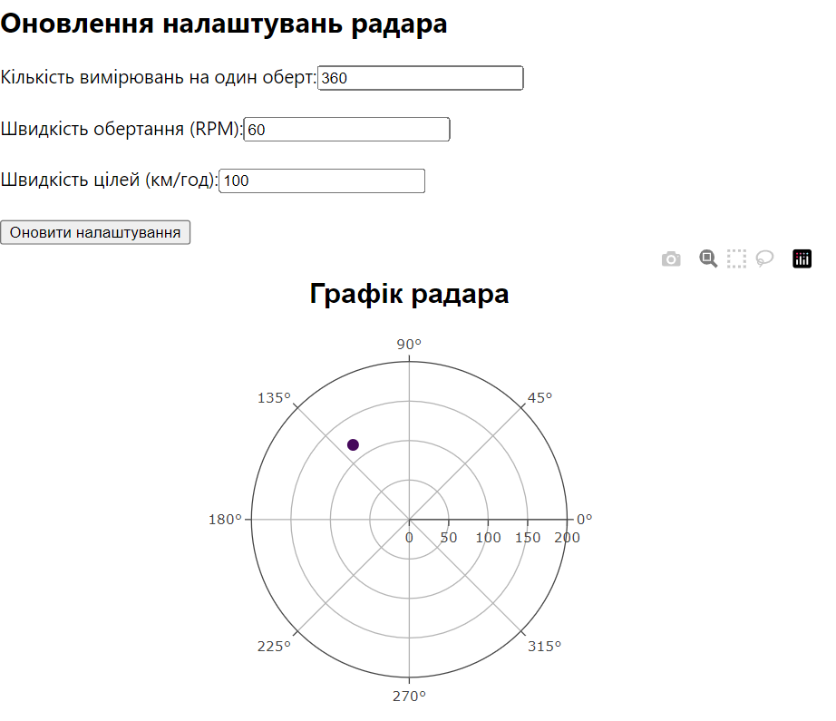

<h3>Розробка додатку для візуалізації вимірювань радару</h3>

<b>1. Створення початкових налаштувань радара</b>  
Встановлено початкові налаштування радара в об'єкті <code>config</code>, що включає кількість вимірювань на оберт (<code>measurementsPerRotation</code>), швидкість обертання (<code>rotationSpeed</code>) та швидкість цілей (<code>targetSpeed</code>). Це дозволяє симулювати різні сценарії роботи радара, відстежуючи цілі з різними параметрами. 

<b>2. Підключення до WebSocket сервера</b>  
Написана функція <code>connectToWebSocket</code>, яка підключається до сервера за адресою <code>ws://localhost:4000</code>. Під час отримання даних через WebSocket обробляються відповіді та додаються нові цілі до масиву цілей для подальшої візуалізації на графіку. 

<b>3. Обробка даних</b>  
Для кожної отриманої відповіді обчислюється відстань до цілі за допомогою формули для обчислення часу сигналу: <code>distance = (time * 300000) / 2</code>, де <code>time</code> —  час поширення сигналу до цілі і назад.  

<b>4. Візуалізація на полярному графіку</b>  
Для візуалізації використана бібліотека <code>Plotly</code>. Дані про цілі відображаються на графіку у вигляді точок з відповідними координатами: <code>кут</code> та <code>відстань</code> (полярні координати). Кольори точок визначаються потужністю сигналу, а кольорова шкала "Viridis" допомагає відобразити рівень потужності для кожної цілі. 

<b>5. Оновлення налаштувань радара</b>  
Створено форму для зміни параметрів радара, яка дозволяє оновлювати кількість вимірювань на оберт, швидкість обертання радара та швидкість цілей. Після введення нових значень дані відправляються на сервер через <code>PUT</code> запит, що дозволяє змінювати поведінку радара в реальному часі. 

<b>Результат:</b> 

